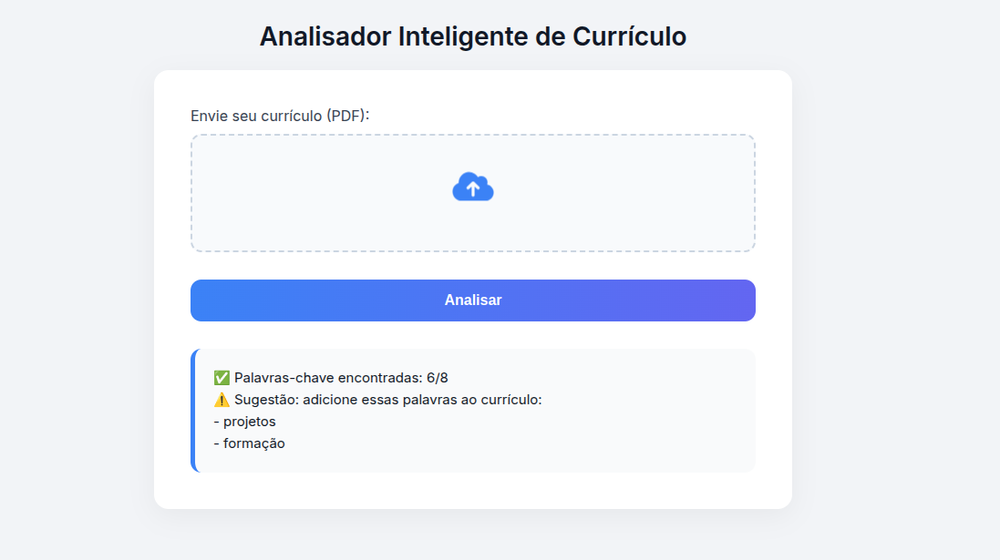

# 📄 Analisador Inteligente de Currículo



Este é um projeto de uma aplicação web moderna e interativa que permite aos usuários **enviar um currículo em PDF** e receber uma análise instantânea baseada em palavras-chave relevantes para o mercado de tecnologia.

## 🚀 Funcionalidades

- ✅ Upload de currículos em PDF com ícone animado
- ✅ Animação de carregamento durante a análise
- ✅ Verificação automática de palavras-chave como `JavaScript`, `HTML`, `CSS`, `React`, etc.
- ✅ Sugestões de melhorias para o conteúdo do currículo
- ✅ Cabeçalho animado e design colorido e responsivo

## 🛠️ Tecnologias utilizadas

- HTML5
- CSS3 (com animações modernas)
- JavaScript
- [PDF.js](https://mozilla.github.io/pdf.js/) (para leitura de PDFs no navegador)

## 📸 Captura de tela

> A imagem abaixo é um exemplo da interface do sistema:
  


## 📂 Como usar

1. Faça o clone do repositório:
   ```bash
   git clone https://github.com/kauagg/bot_curriculo.git
